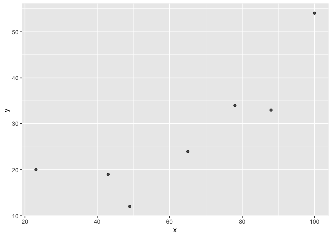
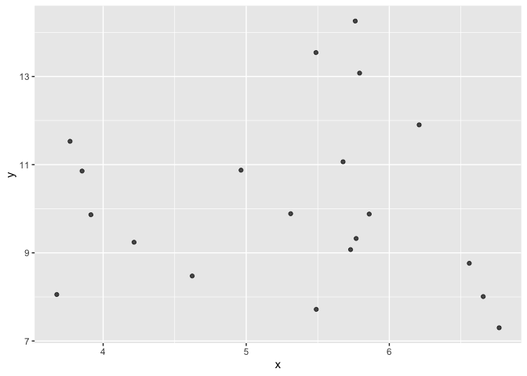
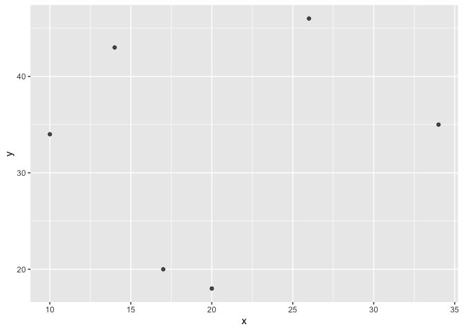

Assignment B-1
================
2024-10-30

``` r
library(ggplot2)
#' @title Scatterplot for two Numeric Variables
#' 
#' @detials This function creates a scatterplot to demonstrate the relationship between two numeric variables. 
#'
#' @param x A numeric vector, I name it x because it represents the x-axis values.
#' @param y A numeric vector that must have the same length with x. I name it y because it represents the y-axis values
#' @return A graph "ggplot" (a scatterplot of the two variables)

graph_relation <- function(x,y){
  if(!is.numeric(x)&&!is.numeric(y)){
    stop('Sorry, at least one of your variables is not numeric input')
  } #check whether the class of variables is numeric
  if(length(x)!=length(y)){
    stop("Sorry, the number of elements in two variables do not match")
  } #check whether the number of elements in two variables match
  data=data.frame(x=x,y=y)
  graph <-  ggplot2::ggplot(data,aes(x=x, y=y))+
    geom_point(aes(x=x,y=y),alpha=0.7)
  return(graph)          
}
```

``` r
#Example 1: create two numeric vectors: x and y, then use graph_relation function
x <- c(43,23,78,100,88,65,49)
y <- c(19,20,34,54,33,24,12)
graph_relation(x,y)
```

<!-- -->

``` r
#Example 2: I simulate two normal-distributed variables x,y, then use graph_relation function
a <- rnorm(20,mean=5, sd=1)
b <- rnorm(20, mean=10, sd=2)
graph_relation(a,b)
```

<!-- -->

``` r
#Example 3: here is one example includes NA, and it shows that geom_point itself removes NAs
a <- c(10,14,24,26,34,17,20,NA)
b <- c(34,43,NA,46,35,20,18,30)
graph_relation(a,b)
```

    ## Warning: Removed 2 rows containing missing values or values outside the scale range
    ## (`geom_point()`).

<!-- -->

``` r
#Example 4: here is an example that the input is not numeric, so I deliberately show this error  
graph_relation("a","b")
```

    ## Error in graph_relation("a", "b"): Sorry, at least one of your variables is not numeric input

``` r
#Example 5: here is an example that the length of two vectors are not equal, so I deliverately show this error 
a <- c(2,3,4,5)
b <- c(5,6,7)
graph_relation(a,b)
```

    ## Error in graph_relation(a, b): Sorry, the number of elements in two variables do not match

``` r
library(testthat)
test_that("test graph_relation function",{
  #test 1: vector with no NA's, expect to show scatterplot
  x1 <- rnorm(10,mean=5, sd=1)
  x2 <- rnorm(10, mean=8, sd=1.5)
  expect_s3_class(graph_relation(x1,x2),"ggplot") 
  #test 2: vector that has NA's, expect to show scatterplot
  x3 <- c(1,2,3,4,NA,6)
  x4 <- c(2,3,4,5,6,NA)
  expect_s3_class(graph_relation(x3,x4),"ggplot")
  #test 3: vector of a different type, expect to show error
  x5 <- c("a","b","c")
  x6 <- c("d","e","f")
  expect_error(graph_relation(x5,x6),"Sorry, at least one of your variables is not numeric input")
})
```

    ## Test passed 😸
